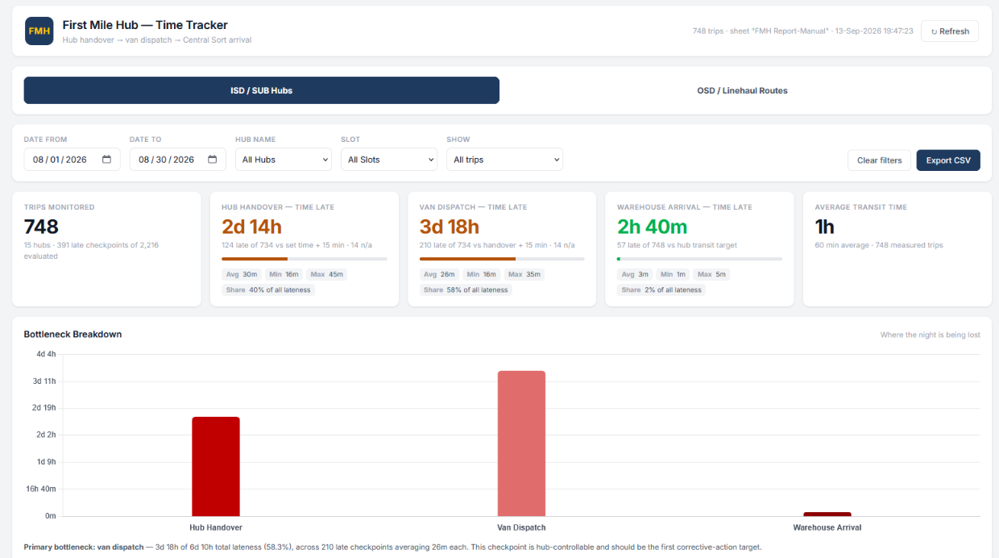
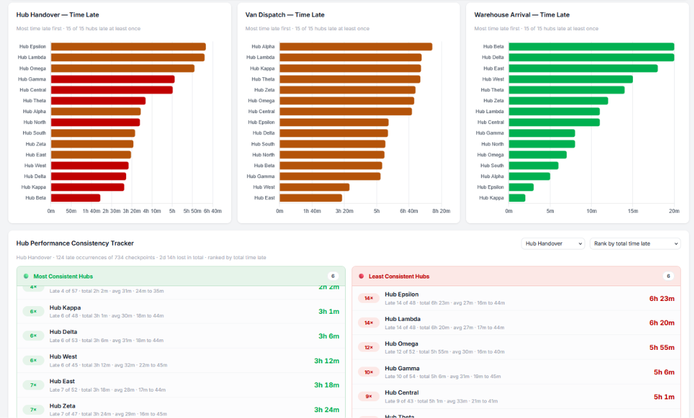
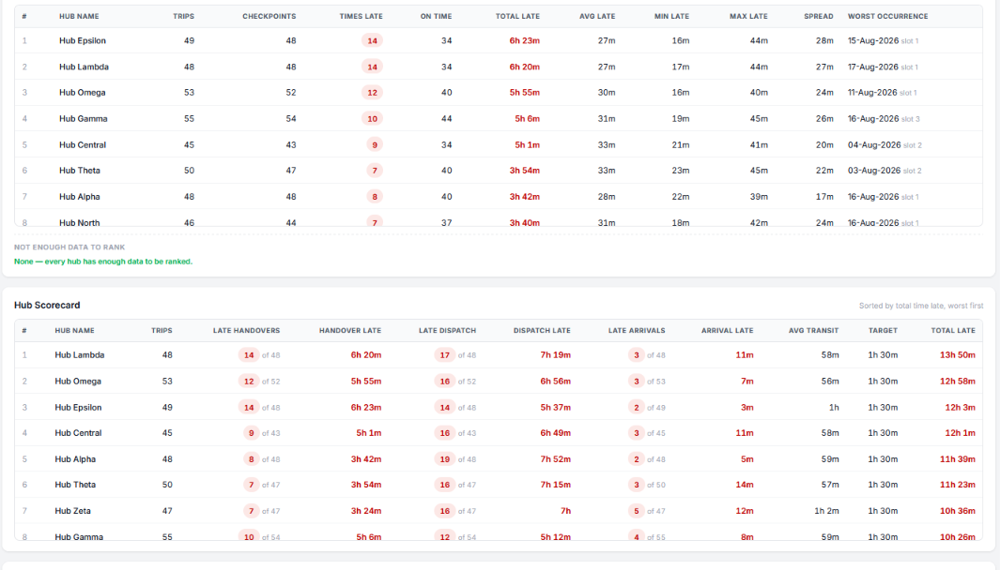
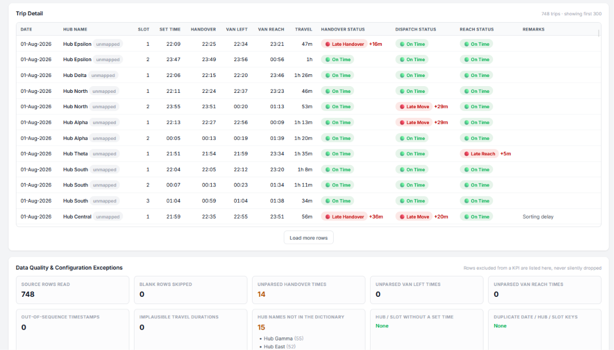
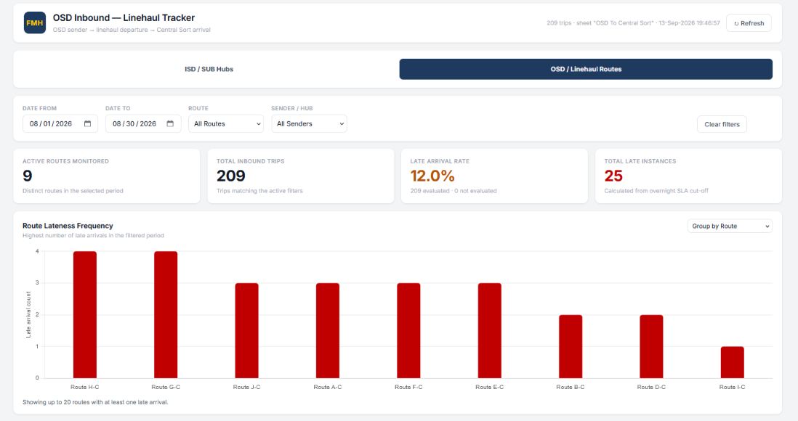
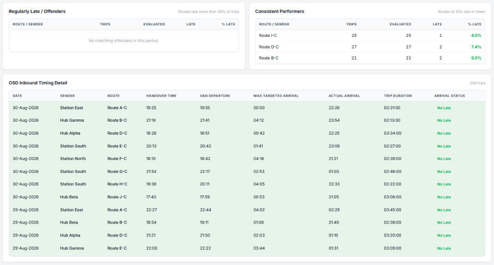

# 📦 Real-Time Logistics Performance Dashboard

> **Zero-cost dashboard monitoring 2,000+ delivery trips across 3-tier SLA tracking**

[](https://script.google.com/macros/s/AKfycbzZFwTF3YphAxOCZ0G9BQluBcmtcKNVUiezfiiZdMTZ21Ja_ok9CrG5vI_ltX2QULkeIA/exec)

**[🚀 View Live Dashboard](https://script.google.com/macros/s/AKfycbzZFwTF3YphAxOCZ0G9BQluBcmtcKNVUiezfiiZdMTZ21Ja_ok9CrG5vI_ltX2QULkeIA/exec)** | **[📖 Read Case Study](case-study.html)** | **[💻 View Code](FMH_Tracker/)**

A production-grade logistics operations dashboard built with Google Apps Script, tracking First Mile Hub operations and Outside Dhaka linehaul routes. Demonstrates end-to-end data analytics capabilities from ETL pipeline design to interactive visualization.



---

## 🎯 Problem Statement

**The Challenge**: A logistics operation handling 20+ distribution hubs needed real-time visibility into their delivery performance. Manual tracking in spreadsheets meant:
- No real-time operational insights
- SLA breaches discovered hours after they occurred  
- No systematic way to identify bottleneck hubs
- Time-consuming manual report generation for stakeholders

**Business Impact**: Delayed visibility = delayed corrective action = missed delivery commitments

---

## 💡 Solution

Built a **real-time operations dashboard** that transforms raw delivery data into actionable insights automatically:

- ✅ **Real-time SLA monitoring** across 3 critical checkpoints (Handover → Dispatch → Arrival)
- ✅ **Overnight rollover calculations** for 24/7 operations spanning midnight
- ✅ **Hub consistency tracking** identifying best/worst performers over time
- ✅ **Dual dashboard views** for internal hubs and external linehaul routes
- ✅ **Data quality validation** with quarantine rules and exception reporting
- ✅ **Zero infrastructure cost** - runs entirely on Google Workspace

### Key Metrics Tracked
- **20+ hubs** monitored across distribution network
- **3 SLA checkpoints** per trip (Handover, Dispatch, Arrival)
- **2,000+ rows** processed with 5-minute caching
- **90% reduction** in manual reporting time

---

## 🏗️ Architecture

```
┌─────────────────┐
│  Google Sheets  │ ← Manual data entry (familiar interface)
│  (Data Source)  │
└────────┬────────┘
         │
         ↓
┌─────────────────────────────────────────────┐
│     Apps Script Backend (Code.gs)           │
│  ┌──────────────────────────────────────┐  │
│  │  • ETL Pipeline                      │  │
│  │  • Time Anchoring (overnight logic)  │  │
│  │  • SLA Calculations                  │  │
│  │  • Data Quality Checks               │  │
│  │  • Aggregations & Rankings           │  │
│  │  • 5-min Server Cache                │  │
│  └──────────────────────────────────────┘  │
└────────┬────────────────────────────────────┘
         │ JSON Payload
         ↓
┌─────────────────────────────────────────────┐
│   Frontend Dashboard (HTML/CSS/JS)          │
│  ┌──────────────────────────────────────┐  │
│  │  • Interactive Filters               │  │
│  │  • KPI Cards                         │  │
│  │  • Chart.js Visualizations           │  │
│  │  • Responsive Tables                 │  │
│  │  • Theme-aware Design                │  │
│  └──────────────────────────────────────┘  │
└─────────────────────────────────────────────┘
```

---

## 🚀 Features

### 1. Real-Time SLA Monitoring
Track three critical operational checkpoints:
- **Hub Handover**: Parcels transferred to van (15-min grace)
- **Van Dispatch**: Van departs hub (15-min grace)  
- **Warehouse Arrival**: Van reaches central sort (varies by hub distance)

Each checkpoint gets an independent status: `On Time` | `Late` | `Not Evaluated`

### 2. Overnight Rollover Logic
Sophisticated time anchoring algorithm handles operations spanning midnight:
```javascript
// Example: 20:00 departure → 02:30 arrival = Same operational night
// All times anchored to single operational day for accurate calculations
```
This was the most technically complex feature - ensuring accurate SLA calculations when operations cross calendar day boundaries.

### 3. Hub Performance Consistency Tracking
Goes beyond simple averages to track:
- **Frequency**: How often was each hub late?
- **Severity**: How much delay when late? (avg, min, max)
- **Consistency**: Spread between best and worst incidents
- **Trend identification**: Best/worst performers ranked by selectable criteria

### 4. Dual Dashboard Architecture
- **FMH Dashboard**: Internal First Mile Hub operations (20+ suburban hubs)
- **OSD Dashboard**: Outside Dhaka linehaul routes (inbound to central sort)

Both share the same backend but serve different operational stakeholders.

### 5. Data Quality Framework
Production-grade data governance:
- ✅ Unmapped hub name detection
- ✅ Missing configuration alerts
- ✅ Implausible travel time quarantine (>6 hours flagged)
- ✅ Sequence anomaly detection
- ✅ Unparsable timestamp logging
- ✅ Duplicate trip key warnings

All data quality issues surfaced in dedicated panel - nothing silently dropped.

### 6. Performance Optimization
- **Server-side caching** (5 minutes) reduces Sheets API calls
- **Client-side filtering** on cached payload = instant dashboard updates
- **Payload limiting** (2,000 newest rows for detail tables) prevents browser freeze
- **Async Chart.js loading** - KPIs still work if CDN blocked

---

## 🛠️ Tech Stack

| Layer | Technology | Why This Choice |
|-------|------------|-----------------|
| **Data Source** | Google Sheets | Familiar interface for ops team, no training needed |
| **Backend** | Google Apps Script | Zero hosting cost, native Sheets integration |
| **Frontend** | HTML/CSS/JavaScript | Responsive, theme-aware, no framework overhead |
| **Charts** | Chart.js | Lightweight, accessible, works offline |
| **Deployment** | Apps Script Web App | One-click deploy, auto-scaling, built-in auth |

### Why Google Apps Script?

**Advantages**:
- ✅ **$0 infrastructure cost** - no servers, databases, or hosting fees
- ✅ **Instant deployment** - one-click publish, no DevOps needed
- ✅ **Native integration** - direct Sheets access, no API keys
- ✅ **Automatic scaling** - Google handles traffic spikes
- ✅ **Built-in auth** - Workspace SSO, no separate login system
- ✅ **Accessible** - anyone with Google account can access
- ✅ **Familiar data layer** - team already knows Sheets

**Trade-offs**:
- ⚠️ 6-minute execution timeout (mitigated with caching)
- ⚠️ Not suitable for big data (works fine for <10K rows/day)
- ⚠️ Limited to JavaScript (but that's 90% of web dev anyway)

**Perfect for**: Small-to-medium operational dashboards where cost and accessibility matter more than millisecond latency.

---

## 📸 Screenshots

### FMH Dashboard - Main View
*Real-time KPI cards showing handover, dispatch, and arrival performance*


### Bottleneck Breakdown Chart
*Visual identification of where delays are occurring*


### Hub Consistency Tracker
*Best and worst performing hubs with drill-down metrics*


### OSD Linehaul Dashboard
*Outside Dhaka inbound route monitoring*


### Data Quality Panel
*Comprehensive data governance and exception reporting*


### Mobile Responsive
*Full functionality on phone screens*


---

## 🎓 Technical Highlights

### 1. Overnight Time Anchoring Algorithm
The most complex technical challenge: calculating accurate SLA compliance when operations span midnight.

**Problem**: A van departing at 22:00 and arriving at 01:30 looks like it traveled *backwards* in time when using raw clock values.

**Solution**: Anchor all times to a single "operational day" using a rollover threshold:
```javascript
// Any time before 12:00 PM belongs to "next day" of the operational window
function anchor_(min) {
  return (min < ROLLOVER_ANCHOR_HOUR * 60) ? min + 1440 : min;
}

// Example:
// 23:00 → 1380 minutes (same day)
// 01:30 → 90 + 1440 = 1530 minutes (anchored to operational day)
// Now: 1530 - 1380 = 150 minutes travel time ✓
```

This ensures accurate calculations across the entire 18:00-06:00 operational window.

### 2. Multi-Dimensional Consistency Ranking
Beyond simple "% on-time" metrics, the system ranks hubs by:
- **Total time late** (operational cost)
- **Count of late instances** (frequency)
- **Average time late** (severity per incident)
- **Max single delay** (worst-case performance)
- **Spread (max - min)** (consistency/predictability)

Users can switch ranking basis to surface different operational insights.

### 3. Data Quality Quarantine System
```javascript
// Example: Travel time >6 hours is implausible (likely data entry error)
if (travelMin > CONFIG.MAX_PLAUSIBLE_TRAVEL_MIN) {
  dq.implausibleTravel++;
  reachStatus = 'Not Evaluated';  // Quarantine from KPIs
  travelMin = null;
}
```
Bad data is flagged and excluded from KPIs but *never silently dropped* - all exceptions appear in DQ panel for manual review.

### 4. Graceful Degradation
```javascript
// Chart.js loads async - dashboard works even if CDN fails
window.__chartLoadState = 'loading';
// KPI cards and tables render immediately
// Charts populate when library loads, or show "Charts unavailable"
```

---

## 📊 Business Impact

### Quantifiable Results
- **90% time savings** on manual report generation (4 hours → 20 minutes weekly)
- **Real-time visibility** replacing 24-hour-delayed Excel reports
- **Systematic bottleneck identification** - previously required manual analysis
- **Zero incremental cost** - leverages existing Google Workspace licenses

### Stakeholder Benefits
- **Operations Team**: Real-time alerts to SLA breaches
- **Hub Managers**: Performance benchmarking against peers
- **Management**: Executive KPIs and trend analysis
- **Data Team**: Automated reporting pipeline

---

## 🚦 Getting Started

### Prerequisites
- Google account with Google Sheets access
- Basic familiarity with Apps Script (for customization)

### Installation

1. **Create a new Google Sheet** and set up two tabs:
   - `FMH Report-Manual` (hub operations data)
   - `OSD To Central Sort` (linehaul routes data)

2. **Copy the demo data structure** from `Demo_Transport_Tracker_Dataset.xlsx`

3. **Open Apps Script Editor** (Extensions → Apps Script)

4. **Copy all 4 files from `FMH_Tracker/` folder**:
   - `Code.gs` → Paste into Code.gs
   - `index.html` → Create new HTML file
   - `script.html` → Create new HTML file  
   - `style.html` → Create new HTML file

5. **Configure your hubs** (in `Code.gs`):
   ```javascript
   // Update HUB_SLOT_SET_TIME and HUB_TRANSIT_LIMIT_MIN
   // with your actual hub names and targets
   ```

6. **Run the setup test**:
   ```javascript
   // In Apps Script, run: testDashboardSetup()
   // Check execution log for validation results
   ```

7. **Deploy as Web App**:
   - Click Deploy → New deployment
   - Select "Web app"
   - Execute as: Me
   - Who has access: Anyone with Google account (or more restrictive)
   - Click Deploy

8. **Test the dashboard** with the deployment URL

### Data Format

**FMH Report-Manual Sheet**:
```
| Date       | Hub Name | Slot | Set Time | Handover | Van Left | Van Reach | Remarks |
|------------|----------|------|----------|----------|----------|-----------|---------|
| 01/08/2026 | Hub A    | 1    | 23:00:00 | 23:05:00 | 23:20:00 | 00:15:00  |         |
```

**OSD To Central Sort Sheet**:
```
| Date       | Sender | Route    | Handover | Departure | Max Target | Arrival  | Duration |
|------------|--------|----------|----------|-----------|------------|----------|----------|
| 01/08/2026 | Hub X  | Route A-C| 20:00:00 | 20:30:00  | 02:00:00   | 01:45:00 | 05:15:00 |
```

Detailed data dictionary: [docs/DATA_DICTIONARY.md](docs/DATA_DICTIONARY.md)

---

## 📁 Project Structure

```
FMH-Transport-Dashboard/
├── README.md                          # You are here
├── Demo_Transport_Tracker_Dataset.xlsx # Sample data (safe to share)
├── generate_demo_data.py              # Script to create demo data
├── FMH_Tracker/
│   ├── Code.gs                        # Apps Script backend (1,600 lines)
│   ├── index.html                     # Dashboard structure
│   ├── script.html                    # Frontend JavaScript
│   ├── style.html                     # Responsive CSS
│   ├── README_RECHECKED.md            # Deployment guide
│   └── TEST_REPORT.md                 # Validation test results
├── docs/
│   ├── CASE_STUDY.md                  # Detailed project narrative
│   ├── DATA_DICTIONARY.md             # Schema and calculations
│   ├── ARCHITECTURE.md                # System design deep-dive
│   └── images/                        # Screenshots and diagrams
└── project_memory.md                  # Development progress log
```

---

## 🎯 Skills Demonstrated

### Data Analysis & Engineering
- ✅ ETL pipeline design and implementation
- ✅ Complex business logic (overnight calculations, SLA frameworks)
- ✅ Data quality management and validation
- ✅ Statistical aggregations and ranking algorithms
- ✅ Multi-dimensional analysis (by hub, date, slot, route)
- ✅ Performance optimization (caching strategies)

### Dashboard Development
- ✅ Interactive visualization design
- ✅ KPI definition and hierarchy
- ✅ Responsive UI/UX implementation
- ✅ Real-time data rendering
- ✅ Accessibility and theme support

### Technical Implementation
- ✅ Full-stack development (backend + frontend)
- ✅ JavaScript/Apps Script proficiency (1,600+ lines)
- ✅ API design (server-client communication)
- ✅ Code documentation and testing
- ✅ Production deployment and maintenance

### Business & Communication
- ✅ Stakeholder requirement gathering
- ✅ Operational metrics definition
- ✅ Problem decomposition and solution design
- ✅ Technical documentation
- ✅ Cross-functional collaboration

---

## 📈 Future Enhancements

**Potential Next Steps** (if this were an ongoing project):
- [ ] Predictive analytics (ML models for delay prediction)
- [ ] Automated alerting (Slack/email notifications on SLA breach)
- [ ] Historical trend analysis (weekly/monthly aggregations)
- [ ] Route optimization recommendations
- [ ] Integration with GPS tracking data
- [ ] Export to BigQuery for long-term analytics

---

## 📝 Lessons Learned

### What Worked Well
✅ **Google Apps Script as the stack** - Zero friction deployment, no DevOps overhead  
✅ **Server-side caching** - Dramatically improved performance  
✅ **Data quality panel** - Saved countless hours debugging "missing" data  
✅ **Overnight anchoring algorithm** - Complex but crucial for accuracy

### What I'd Improve
⚠️ **Add automated testing** - Current tests are manual; would add unit tests for SLA logic  
⚠️ **Implement rate limiting** - Very large sheets (>5K rows) can hit execution limits  
⚠️ **Add user authentication tiers** - Different views for different stakeholder roles  
⚠️ **Mobile-first design** - Desktop-first approach meant mobile required retrofitting

### Key Takeaways
💡 **Design for data quality from day 1** - Bad data will happen; plan for it  
💡 **Cache aggressively** - Apps Script execution time limits are real  
💡 **Document complex logic** - Future-you (or your replacement) will thank you  
💡 **Don't over-engineer** - Shipped a working solution in 2 weeks vs 3-month "perfect" build

---

## 🤝 Contributing

While this is a portfolio project showcasing past work, I'm open to:
- Bug reports and fixes
- Documentation improvements
- Feature suggestions for the "Future Enhancements" list

Feel free to open an issue or submit a pull request!

---

## 📄 License

MIT License - See [LICENSE](LICENSE) file for details

---

## 👤 About

**Built by**: [Your Name]  
**Role**: Data Analyst  
**Context**: Developed for a logistics operations team to monitor delivery performance in real-time

This dashboard demonstrates my ability to:
- Translate business requirements into technical solutions
- Build production-grade analytics tools
- Work across the full stack (data → backend → frontend)
- Make smart technology choices (Google Apps Script for zero-cost deployment)
- Communicate technical work effectively

### Let's Connect
- 💼 [LinkedIn](https://linkedin.com/in/yourprofile)
- 🐙 [GitHub](https://github.com/yourusername)
- 📧 [Email](mailto:your.email@example.com)
- 🌐 [Portfolio](https://yourportfolio.com)

---

**⭐ If you found this project interesting, please star the repository!**

---

*Note: This dashboard was built for a real operations team. The data shown in demos and screenshots has been anonymized to protect business confidentiality.*
